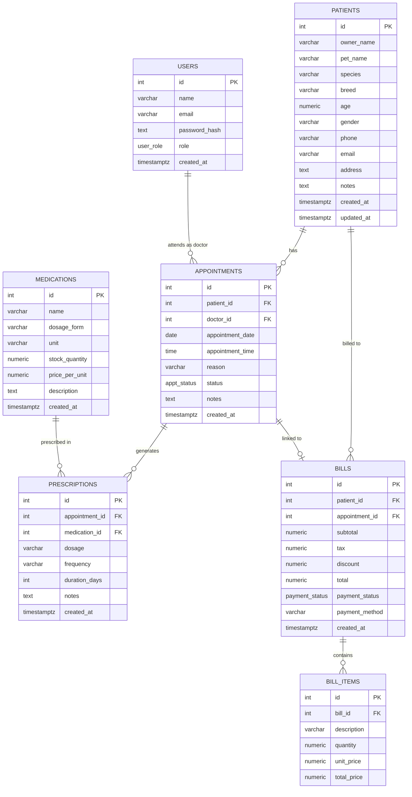

# DocDesk — Entity Relationship Diagram

```mermaid
erDiagram
    USERS {
        int id PK
        varchar name
        varchar email
        text password_hash
        user_role role
        timestamptz created_at
    }

    PATIENTS {
        int id PK
        varchar owner_name
        varchar pet_name
        varchar species
        varchar breed
        numeric age
        varchar gender
        varchar phone
        varchar email
        text address
        text notes
        timestamptz created_at
        timestamptz updated_at
    }

    APPOINTMENTS {
        int id PK
        int patient_id FK
        int doctor_id FK
        date appointment_date
        time appointment_time
        varchar reason
        appt_status status
        text notes
        timestamptz created_at
    }

    MEDICATIONS {
        int id PK
        varchar name
        varchar dosage_form
        varchar unit
        numeric stock_quantity
        numeric price_per_unit
        text description
        timestamptz created_at
    }

    PRESCRIPTIONS {
        int id PK
        int appointment_id FK
        int medication_id FK
        varchar dosage
        varchar frequency
        int duration_days
        text notes
        timestamptz created_at
    }

    BILLS {
        int id PK
        int patient_id FK
        int appointment_id FK
        numeric subtotal
        numeric tax
        numeric discount
        numeric total
        payment_status payment_status
        varchar payment_method
        timestamptz created_at
    }

    BILL_ITEMS {
        int id PK
        int bill_id FK
        varchar description
        numeric quantity
        numeric unit_price
        numeric total_price
    }

    PATIENTS ||--o{ APPOINTMENTS : "has"
    USERS    ||--o{ APPOINTMENTS : "attends as doctor"
    APPOINTMENTS ||--o{ PRESCRIPTIONS : "generates"
    MEDICATIONS  ||--o{ PRESCRIPTIONS : "prescribed in"
    PATIENTS ||--o{ BILLS : "billed to"
    APPOINTMENTS ||--o| BILLS : "linked to"
    BILLS    ||--o{ BILL_ITEMS : "contains"
```
