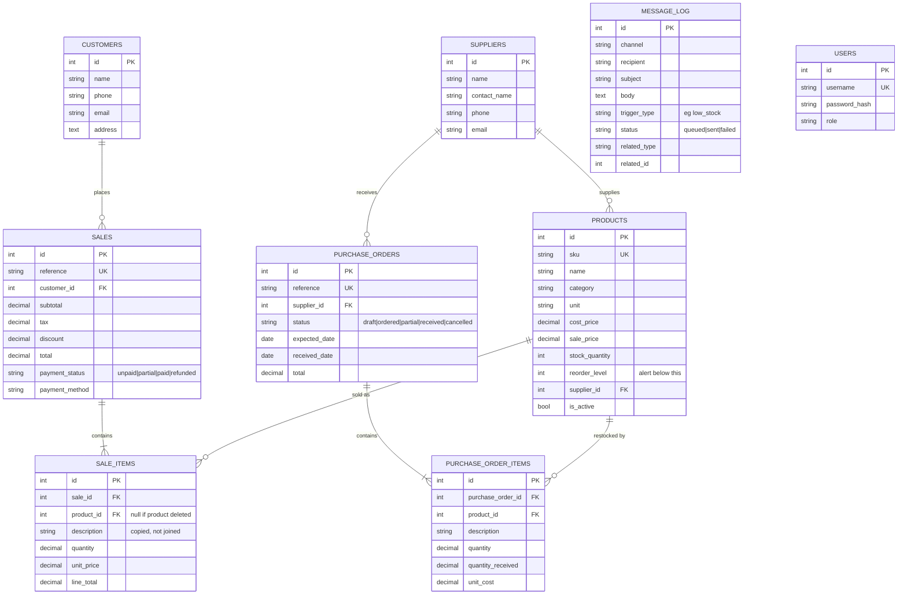

# DocDesk data model

Matches `schema.postgres.sql` and `schema.sqlite.sql`. Update all three together.

## Two things worth knowing

**Line items copy their description rather than joining for it.** `sale_items.description`
is written at the time of sale. Rename or delete a product afterwards and an old
receipt still reads correctly — which is the whole point of a receipt.
`product_id` is kept alongside it for reporting, and goes null if the product is
deleted.

**`message_log` is a queue, not a history.** Phase 2 writes rows here with status
`queued` when a trigger fires (stock dropping below `reorder_level`, an order
being confirmed). Nothing actually sends until Phase 6. Reading this table is how
you check the trigger logic works.

**`users` is unused so far.** Auth is deferred — see `memory.md`.
