# DocDesk data model

PostgreSQL schema built by the migrations in `server/db/migrations/`. This file is generated
from the live catalog (the same data the Database page shows) - regenerate it rather than editing by hand.

```mermaid
erDiagram
    SALES ||--o{ PAYMENTS : "sale_id"
    CATEGORIES |o--o{ PRODUCTS : "category_id"
    SUPPLIERS |o--o{ PRODUCTS : "supplier_id"
    PRODUCTS |o--o{ PURCHASE_ORDER_ITEMS : "product_id"
    PURCHASE_ORDERS ||--o{ PURCHASE_ORDER_ITEMS : "purchase_order_id"
    SUPPLIERS |o--o{ PURCHASE_ORDERS : "supplier_id"
    PRODUCTS |o--o{ SALE_ITEMS : "product_id"
    SALES ||--o{ SALE_ITEMS : "sale_id"
    CUSTOMERS |o--o{ SALES : "customer_id"
    PRODUCTS ||--o{ STOCK_MOVEMENTS : "product_id"
    AUDIT_LOG {
        bigint id PK
        text table_name
        bigint record_id
        text record_key
        text action
        text actor
        text_array changed_fields
        jsonb old_data
        jsonb new_data
        bigint txid
        timestamptz created_at
    }
    CATEGORIES {
        bigint id PK
        text name
        text description
        timestamptz created_at
        timestamptz updated_at
    }
    CUSTOMERS {
        bigint id PK
        text name
        text phone
        text email
        text address
        text notes
        timestamptz created_at
        timestamptz updated_at
        integer row_version
    }
    FILES {
        bigint id PK
        text stored_name
        text original_name
        text mime_type
        bigint size_bytes
        text description
        text related_type
        bigint related_id
        timestamptz created_at
    }
    MESSAGE_LOG {
        bigint id PK
        text channel
        text recipient
        text subject
        text body
        text trigger_type
        text status
        text related_type
        bigint related_id
        text error
        timestamptz created_at
        timestamptz sent_at
    }
    PAYMENTS {
        bigint id PK
        bigint sale_id FK
        numeric amount
        text method
        text kind
        text note
        timestamptz paid_at
        timestamptz created_at
    }
    PRODUCTS {
        bigint id PK
        text sku
        text name
        text description
        bigint category_id FK
        text unit
        numeric cost_price
        numeric sale_price
        numeric stock_quantity
        numeric reorder_level
        bigint supplier_id FK
        boolean is_active
        timestamptz created_at
        timestamptz updated_at
        integer row_version
    }
    PURCHASE_ORDER_ITEMS {
        bigint id PK
        bigint purchase_order_id FK
        bigint product_id FK
        text description
        numeric quantity
        numeric quantity_received
        numeric unit_cost
        numeric line_total
    }
    PURCHASE_ORDERS {
        bigint id PK
        text reference
        bigint supplier_id FK
        text status
        date expected_date
        date received_date
        numeric total
        text notes
        timestamptz created_at
        timestamptz updated_at
    }
    SALE_ITEMS {
        bigint id PK
        bigint sale_id FK
        bigint product_id FK
        text description
        numeric quantity
        numeric unit_price
        numeric unit_cost
        numeric line_total
    }
    SALES {
        bigint id PK
        text reference
        bigint customer_id FK
        numeric subtotal
        numeric discount
        numeric tax_rate
        numeric tax
        numeric total
        numeric amount_paid
        text payment_status
        text payment_method
        text notes
        timestamptz created_at
        timestamptz updated_at
    }
    SAVED_QUERIES {
        bigint id PK
        text name
        text description
        text sql
        boolean pinned
        integer run_count
        timestamptz last_run_at
        timestamptz created_at
        timestamptz updated_at
    }
    SCHEMA_MIGRATIONS {
        text version PK
        text name
        text checksum
        timestamptz applied_at
        integer duration_ms
    }
    SETTINGS {
        text key PK
        text value
        timestamptz updated_at
    }
    STOCK_MOVEMENTS {
        bigint id PK
        bigint product_id FK
        numeric change
        numeric balance_after
        text kind
        text reference_type
        bigint reference_id
        text note
        text actor
        timestamptz created_at
    }
    SUPPLIERS {
        bigint id PK
        text name
        text contact_name
        text phone
        text email
        text address
        text notes
        timestamptz created_at
        timestamptz updated_at
        integer row_version
    }
    USERS {
        bigint id PK
        text username
        text password_hash
        text role
        timestamptz created_at
    }
```

## Tables

### audit_log

Every insert, update and delete on business tables, with before and after values. Written by triggers.

Rules enforced by the database:

- `audit_log_action_check` - check: `CHECK ((action = ANY (ARRAY['INSERT'::text, 'UPDATE'::text, 'DELETE'::text])))`

Indexes: `audit_log_created_idx`, `audit_log_record_idx`

### categories

Product groupings. Stored once and referenced, so renaming a category renames it everywhere.

Rules enforced by the database:

- `categories_name_length` - check: `CHECK (((length(btrim(name)) >= 1) AND (length(btrim(name)) <= 100)))`

Triggers:

- `categories_audit` runs `audit_row()` - Generic audit trigger: records the row before and after every change, and which columns changed.
- `categories_touch` runs `touch_row()`

Indexes: `categories_name_key`

### customers

People and businesses you sell to.

Rules enforced by the database:

- `customers_email_format` - check: `CHECK (((email IS NULL) OR (email ~* '^[^@\s]+@[^@\s]+\.[^@\s]+$'::text)))`
- `customers_name_length` - check: `CHECK (((length(btrim(name)) >= 1) AND (length(btrim(name)) <= 150)))`
- `customers_phone_length` - check: `CHECK (((phone IS NULL) OR (length(phone) <= 40)))`

Triggers:

- `customers_audit` runs `audit_row()` - Generic audit trigger: records the row before and after every change, and which columns changed.
- `customers_touch` runs `touch_row()`

Indexes: `customers_email_trgm_idx`, `customers_name_idx`, `customers_name_trgm_idx`, `customers_phone_idx`

### files

Metadata for uploaded documents. The bytes live on disk under a generated name.

Rules enforced by the database:

- `files_stored_name_key` - unique: `UNIQUE (stored_name)`
- `files_related_pair` - check: `CHECK (((related_type IS NULL) = (related_id IS NULL)))`
- `files_related_type_check` - check: `CHECK (((related_type IS NULL) OR (related_type = ANY (ARRAY['product'::text, 'sale'::text, 'customer'::text, 'supplier'::text, 'purchase_order'::text]))))`
- `files_size_check` - check: `CHECK ((size_bytes >= 0))`

Triggers:

- `files_audit` runs `audit_row()` - Generic audit trigger: records the row before and after every change, and which columns changed.

Indexes: `files_stored_name_key`, `files_created_at_idx`, `files_related_idx`

### message_log

Alerts and confirmations DocDesk decided to send. Delivery is simulated until a provider is connected.

Rules enforced by the database:

- `message_log_channel_check` - check: `CHECK ((channel = ANY (ARRAY['email'::text, 'sms'::text, 'whatsapp'::text])))`
- `message_log_status_check` - check: `CHECK ((status = ANY (ARRAY['queued'::text, 'sent'::text, 'failed'::text])))`

Indexes: `message_log_one_queued_low_stock` (partial), `message_log_queued_idx` (partial), `message_log_status_created_idx`

### payments

Money received against a sale. A negative amount is a refund. Several rows make a part-payment history.

Rules enforced by the database:

- `payments_amount_non_zero` - check: `CHECK ((amount <> (0)::numeric))`
- `payments_method_check` - check: `CHECK ((method = ANY (ARRAY['cash'::text, 'card'::text, 'upi'::text, 'bank'::text, 'other'::text])))`

Triggers:

- `payments_audit` runs `audit_row()` - Generic audit trigger: records the row before and after every change, and which columns changed.
- `payments_sync_sale` runs `payments_sync_sale()`

Indexes: `payments_sale_id_idx`

### products

The catalogue. stock_quantity is a running balance kept in step with stock_movements.

Rules enforced by the database:

- `products_cost_price_check` - check: `CHECK ((cost_price >= (0)::numeric))`
- `products_name_length` - check: `CHECK (((length(btrim(name)) >= 1) AND (length(btrim(name)) <= 200)))`
- `products_reorder_level_check` - check: `CHECK ((reorder_level >= (0)::numeric))`
- `products_sale_price_check` - check: `CHECK ((sale_price >= (0)::numeric))`
- `products_sku_length` - check: `CHECK (((sku IS NULL) OR ((length(sku) >= 1) AND (length(sku) <= 80))))`
- `products_stock_quantity_check` - check: `CHECK ((stock_quantity >= (0)::numeric))`

Triggers:

- `products_audit` runs `audit_row()` - Generic audit trigger: records the row before and after every change, and which columns changed.
- `products_low_stock_alert` runs `products_low_stock_alert()`
- `products_stock_ledger` runs `products_stock_ledger()`
- `products_touch` runs `touch_row()`

Indexes: `products_sku_key` (partial), `products_category_id_idx`, `products_name_idx`, `products_name_trgm_idx`, `products_needs_restock_idx` (partial), `products_sku_trgm_idx`, `products_supplier_id_idx`

### purchase_order_items

Rules enforced by the database:

- `purchase_order_items_cost_check` - check: `CHECK ((unit_cost >= (0)::numeric))`
- `purchase_order_items_description_length` - check: `CHECK (((length(btrim(description)) >= 1) AND (length(btrim(description)) <= 250)))`
- `purchase_order_items_quantity_positive` - check: `CHECK ((quantity > (0)::numeric))`
- `purchase_order_items_received_range` - check: `CHECK (((quantity_received >= (0)::numeric) AND (quantity_received <= quantity)))`

Triggers:

- `purchase_order_items_receive` runs `purchase_order_items_receive()`

Indexes: `purchase_order_items_order_idx`, `purchase_order_items_product_idx`

### purchase_orders

Stock ordered from a supplier. Status follows what has actually been received.

Rules enforced by the database:

- `purchase_orders_reference_key` - unique: `UNIQUE (reference)`
- `purchase_orders_status_check` - check: `CHECK ((status = ANY (ARRAY['draft'::text, 'ordered'::text, 'partial'::text, 'received'::text, 'cancelled'::text])))`
- `purchase_orders_total_check` - check: `CHECK ((total >= (0)::numeric))`

Triggers:

- `purchase_orders_audit` runs `audit_row()` - Generic audit trigger: records the row before and after every change, and which columns changed.
- `purchase_orders_reference` runs `assign_reference()`
- `purchase_orders_touch` runs `touch_row()`

Indexes: `purchase_orders_reference_key`, `purchase_orders_status_created_idx`, `purchase_orders_supplier_id_idx`

### sale_items

Rules enforced by the database:

- `sale_items_description_length` - check: `CHECK (((length(btrim(description)) >= 1) AND (length(btrim(description)) <= 250)))`
- `sale_items_prices_non_negative` - check: `CHECK (((unit_price >= (0)::numeric) AND (unit_cost >= (0)::numeric)))`
- `sale_items_quantity_positive` - check: `CHECK ((quantity > (0)::numeric))`

Triggers:

- `sale_items_move_stock` runs `sale_items_move_stock()`
- `sale_items_totals_check` runs `sales_check_totals()`

Indexes: `sale_items_description_trgm_idx`, `sale_items_product_id_idx`, `sale_items_sale_id_idx`

### sales

One row per receipt. amount_paid and payment_status are derived from payments by a trigger.

Rules enforced by the database:

- `sales_reference_key` - unique: `UNIQUE (reference)`
- `sales_amounts_non_negative` - check: `CHECK (((subtotal >= (0)::numeric) AND (discount >= (0)::numeric) AND (tax >= (0)::numeric) AND (total >= (0)::numeric)))`
- `sales_discount_le_subtotal` - check: `CHECK ((discount <= subtotal))`
- `sales_paid_range` - check: `CHECK (((amount_paid >= (0)::numeric) AND (amount_paid <= total)))`
- `sales_payment_status_check` - check: `CHECK ((payment_status = ANY (ARRAY['unpaid'::text, 'partial'::text, 'paid'::text, 'refunded'::text])))`
- `sales_tax_rate_range` - check: `CHECK (((tax_rate >= (0)::numeric) AND (tax_rate <= (100)::numeric)))`
- `sales_total_consistent` - check: `CHECK ((total = ((subtotal - discount) + tax)))`

Triggers:

- `sales_audit` runs `audit_row()` - Generic audit trigger: records the row before and after every change, and which columns changed.
- `sales_reference` runs `assign_reference()`
- `sales_totals_check` runs `sales_check_totals()`
- `sales_touch` runs `touch_row()`

Indexes: `sales_reference_key`, `sales_created_at_idx`, `sales_customer_created_idx`, `sales_outstanding_idx` (partial)

### saved_queries

Queries saved from the SQL console, with how often each has been run.

Rules enforced by the database:

- `saved_queries_name_length` - check: `CHECK (((char_length(btrim(name)) >= 1) AND (char_length(btrim(name)) <= 120)))`
- `saved_queries_run_count_positive` - check: `CHECK ((run_count >= 0))`
- `saved_queries_sql_length` - check: `CHECK (((char_length(btrim(sql)) >= 1) AND (char_length(btrim(sql)) <= 20000)))`

Triggers:

- `saved_queries_touch` runs `touch_row()`

Indexes: `saved_queries_name_key`, `saved_queries_pinned_idx`

### schema_migrations

### settings

Business details and preferences as key/value pairs, so a new setting needs no migration.

Rules enforced by the database:

- `settings_key_format` - check: `CHECK ((key ~ '^[a-z][a-z0-9_]{0,79}$'::text))`

Triggers:

- `settings_audit` runs `audit_row()` - Generic audit trigger: records the row before and after every change, and which columns changed.
- `settings_touch` runs `touch_row()`

### stock_movements

The stock ledger: every change to every product's stock, why it happened and the balance after. Written by triggers, never by hand.

Rules enforced by the database:

- `stock_movements_balance_check` - check: `CHECK ((balance_after >= (0)::numeric))`
- `stock_movements_change_non_zero` - check: `CHECK ((change <> (0)::numeric))`
- `stock_movements_kind_check` - check: `CHECK ((kind = ANY (ARRAY['opening'::text, 'sale'::text, 'sale_void'::text, 'purchase_receipt'::text, 'adjustment'::text, 'correction'::text, 'import'::text])))`

Indexes: `stock_movements_created_idx`, `stock_movements_product_created_idx`

### suppliers

Businesses you buy stock from.

Rules enforced by the database:

- `suppliers_email_format` - check: `CHECK (((email IS NULL) OR (email ~* '^[^@\s]+@[^@\s]+\.[^@\s]+$'::text)))`
- `suppliers_name_length` - check: `CHECK (((length(btrim(name)) >= 1) AND (length(btrim(name)) <= 150)))`
- `suppliers_phone_length` - check: `CHECK (((phone IS NULL) OR (length(phone) <= 40)))`

Triggers:

- `suppliers_audit` runs `audit_row()` - Generic audit trigger: records the row before and after every change, and which columns changed.
- `suppliers_touch` runs `touch_row()`

Indexes: `suppliers_name_idx`, `suppliers_name_trgm_idx`

### users

Reserved for sign-in, which is not switched on yet.

Rules enforced by the database:

- `users_role_check` - check: `CHECK ((role = ANY (ARRAY['owner'::text, 'manager'::text, 'staff'::text])))`

Indexes: `users_username_key`

## Views

- `v_customer_stats` - Lifetime value, visits, average spend and money owed, per customer.
- `v_product_stock` - Each product with its category, supplier, stock status, stock value and margin.
- `v_sales` - Each sale with customer, balance due, cost of goods and gross profit (excluding tax).
- `v_supplier_stats` - Orders, spend and open orders per supplier.

## Functions

- `app_actor()` returns text - Who is making the current change, as set by the API for the transaction.
- `app_clock()` returns timestamp with time zone - The time to record: now(), unless a backdated import or sample-data load overrides it.
- `app_restoring()` returns boolean
- `app_setting(p_name text)` returns text
- `apply_stock_change(p_product_id bigint, p_change numeric, p_kind text, p_reference_type text, p_reference_id bigint, p_note text)` returns numeric - Moves stock for one product and records why, atomically. Rejects changes that would leave stock below zero.
- `business_timezone()` returns text
- `report_sales_by_day(p_from date, p_to date, p_tz text)` returns TABLE(day date, sale_count bigint, revenue numeric, profit numeric) - Daily revenue, sale count and gross profit in the given timezone, gaps filled.
- `report_sales_heatmap(p_from date, p_to date, p_tz text)` returns TABLE(dow integer, hour integer, sale_count bigint, revenue numeric) - Sale count and revenue by day of week (0 = Sunday) and hour of day.
- `assign_reference()` (trigger)
- `audit_row()` (trigger) - Generic audit trigger: records the row before and after every change, and which columns changed.
- `payments_sync_sale()` (trigger)
- `products_low_stock_alert()` (trigger)
- `products_stock_ledger()` (trigger)
- `purchase_order_items_receive()` (trigger)
- `sale_items_move_stock()` (trigger)
- `sales_check_totals()` (trigger)
- `touch_row()` (trigger)
